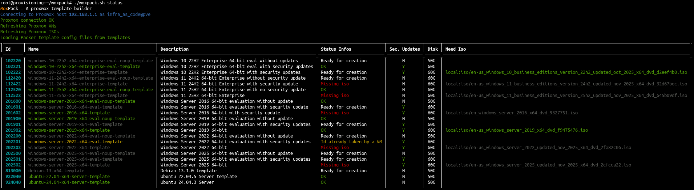

# MoxPack


A Qemu Proxmox Template builder project using Packer 📦

## Prerequisites
- [Packer](https://developer.hashicorp.com/packer)
- Python3
- Create a user and an associated api token in proxmox (be sure to give the user enough privileges)

## Usage
- Copy variables.auto.pkrvars.hcl.template to variables.auto.pkrvars.hcl
- Run ./create_symlinks.sh
- Complete the informations on variables.auto.pkrvars.hcl
- Run `./moxpack.sh status`



## Template to build GOAD
- Windows Server 2016 - x64 - eval no update : 201600
- Windows Server 2019 - x64 - eval updated   : 201901
- Windows Server 2019 - x64 - eval no update : 201900
- Windows 10 22h2 - x64 - eval updated       : 102221
- Ubuntu server 24.04                        : 924040

```
# prepare your template for GOAD installation on proxmox
./moxpack.sh build 201600 201901 201900 102221 924040
```

## Templates ID:

| vm_id  | template name                                     |
|--------|---------------------------------------------------|
| 102220 | windows-10-22h2-x64-enterprise-eval-noup-template |
| 102221 | windows-10-22h2-x64-enterprise-template           |
| 102221 | windows-10-22h2-x64-enterprise-eval-template      |
| 112420 | windows-11-24h2-x64-enterprise-eval-noup-template |
| 112422 | windows-11-24h2-x64-enterprise-template           |
| 112520 | windows-11-25h2-x64-enterprise-eval-noup-template |
| 112522 | windows-11-25h2-x64-enterprise-template           |
| 201600 | windows-server-2016-x64-eval-noup-template        |
| 201601 | windows-server-2016-x64-eval-template             |
| 201602 | windows-server-2016-x64-template                  |
| 201900 | windows-server-2019-x64-eval-noup-template        |
| 201901 | windows-server-2019-x64-eval-template             |
| 201902 | windows-server-2019-x64-template                  |
| 202200 | windows-server-2022-x64-eval-noup-template        |
| 202201 | windows-server-2022-x64-eval-template             |
| 202202 | windows-server-2022-x64-template                  |
| 202500 | windows-server-2025-x64-eval-noup-template        |
| 202501 | windows-server-2025-x64-eval-template             |
| 202502 | windows-server-2025-x64-template                  |
| 813000 | debian-13-x64-template                            |
| 922040 | ubuntu-22.04-x64-server-template                  |
| 924040 | ubuntu-24.04-x64-server-template                  |


## Windows templates

- The windows template are created using evaluation version : 180 days for server / 90 days for workstation
- The Windows templates are cloudInit Ready and sysprepared
- Default language is EN-US
- Default keyboards are US + FR
- Default timezone is Europe/Paris

## Usage with key
- If you install a windows not "eval" you should enter a key once the vm is cloned to activate windows.

## Firewall settings
- Vm using MoxPack must be allowed to access the vms created with winrm (5985/5986)
- The vm created must be able to access the vm running proxmox pack with http on ports 8000-9000

## Thanks
- This project was inspired by those projects, thanks to them !
- Ludus: [https://gitlab.com/badsectorlabs/ludus/-/tree/main/templates](https://gitlab.com/badsectorlabs/ludus/-/tree/main/templates)
- proxmox-packer-templates : [https://github.com/Pumba98/proxmox-packer-templates](https://github.com/Pumba98/proxmox-packer-templates)
- And of course all my previous work on GOAD [https://github.com/Orange-Cyberdefense/GOAD](https://github.com/Orange-Cyberdefense/GOAD)
